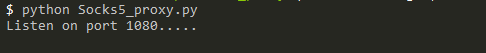
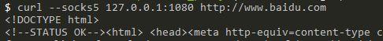

# Socks5_proxy

### Usage:
```
  python Socks5_proxy.py       -- run on 1080
  python Socks5_proxy.py 2333  -- run on 2333
```
### Test:





### Reference:

- [ssocks5](https://github.com/felix021/ssocks5/blob/master/ssocks5.py)
- [repocks](https://github.com/RicterZ/reprocks/blob/master/server/reprocks_server.py)
- [rfc1928](https://www.ietf.org/rfc/rfc1928.txt)